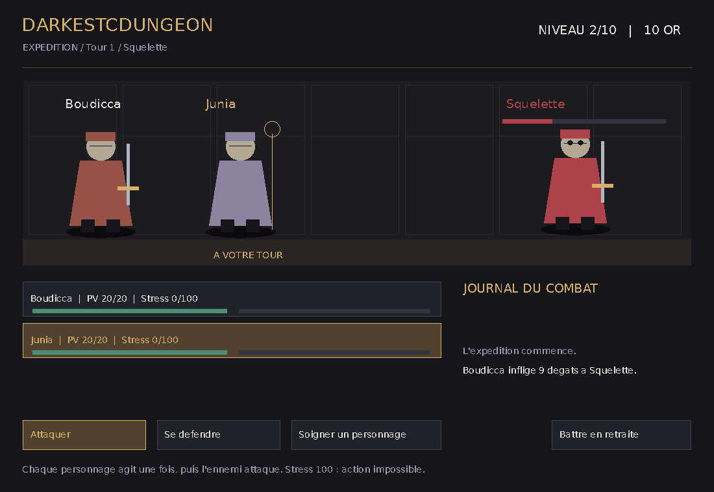
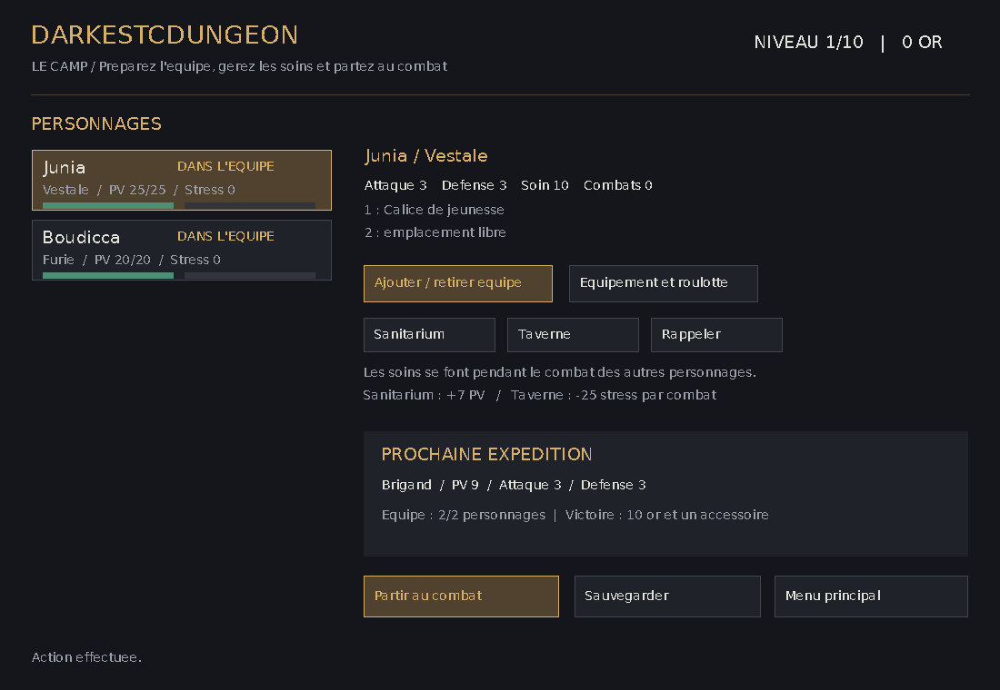
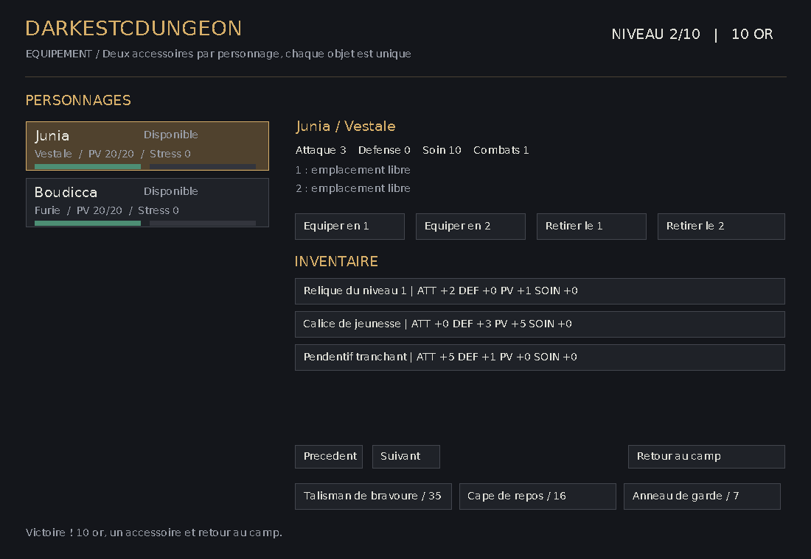

# Darkestcdungeon

Jeu tactique en C inspiré de Darkest Dungeon : une équipe de personnages traverse dix combats en gérant ses points de vie, son stress et ses accessoires.

Projet universitaire de L2 Informatique (2024–2025). Le sujet et le rapport d'origine sont conservés dans le dépôt. Le mode graphique MLV prolonge la version terminal et utilise le même moteur de jeu.

## Gameplay







Captures de l'application MLV exécutée : équipement des héros, première victoire, sauvegarde, chargement et combat suivant.

## Fonctionnalités

- Dix niveaux, quatre classes de personnages et recrutement après les niveaux 2, 4, 6 et 8.
- Équipe de un à deux personnages, puis jusqu'à trois à partir du niveau 6.
- Combat au tour par tour : attaque, défense et soin d'un allié ou de soi-même.
- Gestion du stress : un personnage à 100 de stress ne peut plus agir.
- Deux emplacements d'accessoires par personnage, inventaire partagé et achats à la roulotte.
- Sanitarium et taverne : récupération de vie et diminution du stress pendant les combats des autres héros.
- Sauvegarde entre les combats : progression, or, personnages au repos, équipements, inventaire et stock de la roulotte.
- Interfaces terminal et graphique ; aucune bibliothèque graphique n'est nécessaire pour la version terminal.

## Compilation et lancement

### Version terminal

Prérequis : un compilateur C compatible C99 et Make.

```bash
make
./game
```

Compilation manuelle équivalente :

```bash
gcc -Wall -Wextra -Werror -std=c99 main.c combat.c character.c accessory.c save_load.c dungeon.c -o game
```

### Version graphique

Prérequis supplémentaires : [MLV 3.x](https://www-igm.univ-mlv.fr/~boussica/mlv/index.html), son module `pkg-config`, une session graphique et la police DejaVu Sans. La disponibilité des paquets MLV dépend de la distribution ; suivre les instructions de la bibliothèque si elle n'est pas dans ses dépôts.

```bash
pkg-config --modversion MLV
make gui
./game-gui
```

L'interface se contrôle à la souris. Sélectionner un personnage puis **Ajouter / retirer équipe** ; préparer ses accessoires dans **Équipement et roulotte**, puis **Partir au combat**. Pour un soin, cliquer sur **Soigner un personnage**, puis sur sa cible. Le sanitarium et la taverne accueillent chacun jusqu'à deux personnages.

La police par défaut est `/usr/share/fonts/truetype/dejavu/DejaVuSans.ttf`. Pour utiliser un autre fichier TrueType :

```bash
DUNGEON_FONT=/chemin/vers/police.ttf ./game-gui
```

### Sauvegardes

Les deux interfaces utilisent `savegame.dcd`, dans le répertoire de lancement. Le chargement reprend la campagne au niveau enregistré. Les sauvegardes de l'ancien format sont également acceptées. Un fichier incomplet ou invalide est refusé ; une sauvegarde réussie remplace le fichier précédent après écriture complète.

## Vérification

```bash
make test
```

Les tests couvrent notamment la sélection sans doublon, la propriété des accessoires, les soins et récompenses, la disparition des héros morts, les sauvegardes complètes, l'ancien format et le rejet de sauvegardes invalides.

## Organisation technique

| Fichiers | Rôle |
|---|---|
| `structures.h` | Classes, personnages, ennemis et état de la partie |
| `character.c` / `.h` | Personnages et listes chaînées |
| `accessory.c` / `.h` | Accessoires et transferts de propriété |
| `dungeon.c` / `.h` | Campagne, équipe, équipement, soins et roulotte |
| `combat.c` / `.h` | Actions, dégâts, stress et résolution du combat |
| `save_load.c` / `.h` | Persistance et validation des fichiers |
| `main.c` | Interface terminal |
| `gui.c` / `.h`, `gui_main.c` | Interface graphique MLV |
| `tests/test_gameplay.c` | Tests du moteur sans dépendance graphique |

Les personnages et accessoires sont gérés par listes chaînées. Un accessoire appartient à un seul inventaire ou emplacement à la fois. Les deux interfaces appellent les mêmes fonctions de campagne et de combat. Les illustrations sont dessinées par l'application avec les primitives MLV.

## Documents d'origine

- [Sujet du projet](projet_2024_2025.pdf)
- [Rapport universitaire](Rapport_PLESSY_VINCENT_TP1.pdf)

## Auteur

Vincent Plessy — Étudiant en L2 Informatique (2024–2025).
